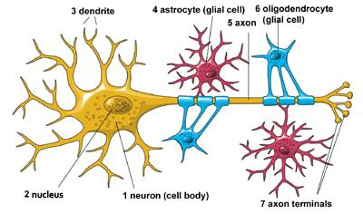
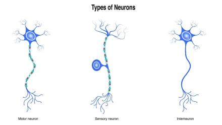

# Artificial Living Intelligence (ALI)
## Contribuators
* Freeman Trader - github.com/Freeman-Trader

## Methodology
This project aims to emulate (and possibly simulate) the workings of a human brain in hopes to recreate human intelligence and creativity. We plan on doing this by simulating neurons and the structures they form as closely as possible.

## Design
### Neurons
Neurons are the lowest level of practical simulation. Going any lower would require exponential computing power, while going any higher would remove important nuances of the simulation.

* The core idea of a neuron is that it receives charges from its neighboring neurons, building up its own charge. Once the charge of a neuron passes a certain threshold, that same neuron emits its own charge, progressing the chain reaction.

* The neuron has 2 main components, the Dendrite and the Axon. The Dendrite receives the charges while the Axon emits charge. [1]

* There are 3 main types of neurons, all of which are specialized in specific tasks. Sensory neurons carry information from sensory organs to the brain. Motor neurons control muscles, specifically voluntary muscles.
All other types are grouped under the interneuron category. [1]

**Sources**
* [1] [NIH](https://www.ninds.nih.gov/health-information/public-education/brain-basics/brain-basics-life-and-death-neuron)